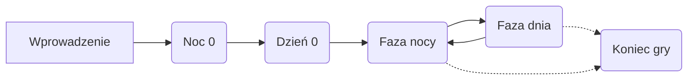
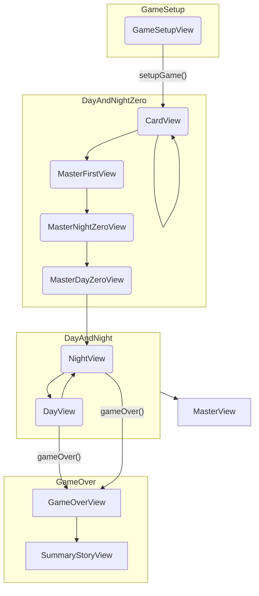

# Przebieg rozgrywki

### views

**GameSetupView** - Ustawienie gry, czyli:
- wybór czy gra jest online
- wybór ilości graczy, osób w frakcjach
- wyświetlanie listy graczy
- wyświetlanie listy postaci

Następnie wywołanie metody `setupGame()`, w tym sprawdzić, czy wszystko zostało dobrze ustawione:
- czy w grze są wybrane frakcje *miasto* i *mafia*
- czy liczba graczy jest zgodna z liczbą postaci
- czy liczba postaci jest zgodna z liczbą przy frakcji

**CardView** - wyświetlenie kart postaci dla gracza.

SummaryStoryView - podsumowanie gry w formie wyświetlanej historii
